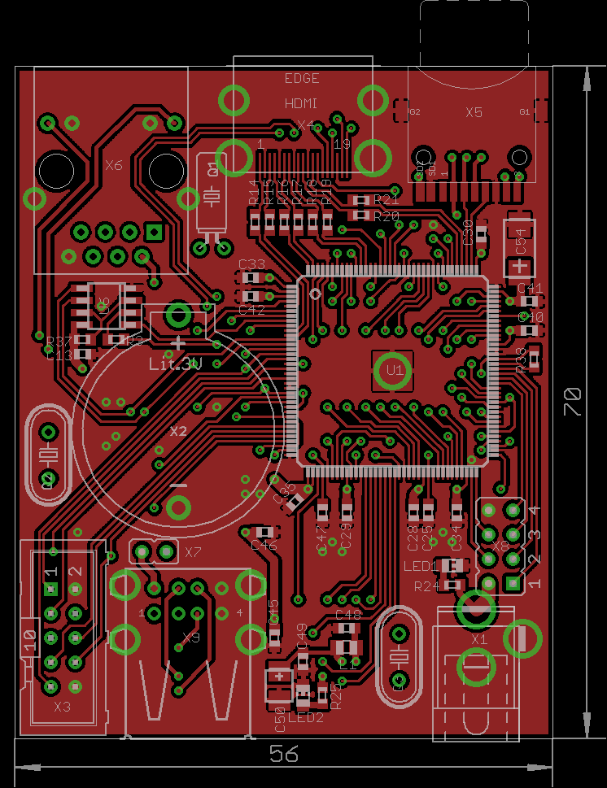

# Плата ReVerSE-U16 Rev.B
Исправлена разводка, SPI Flash M25P16 замененил на W25Q64FV(64Mbit) для конфигураций использующих загрузку ROM из SPI-FLASH.

#### Оставил взаимозаменяемость:
- FPGA Cyclone III EP3C5/10/16/25, Cyclone IV EP4CE6/10/15/22 в корпусах EQFP 144-Pin (не забывайте припаивать корпус снизу);
- SDRAM 4/16/32MB x 16-bit и 4/16/32MB x 8-bit в корпусах TSOP (400 mil) 54-Pin;
- SPI-FLASH 1/16/64/128Mbit в корпусах SOIC (208 mil) 8-Pin;
- RTC I2C 3.3V DS1338 и DS1307 в корпусах SO 8-Pin

Пока я не проверял работу ENC424 со стороны разъема HR911105A, работа интерфейса со стороны FPGA проверена (подача команд и чтение работает, пример - чтение MAC адреса и реализация интерфейса в конфигурации TS-Conf). Можно уже пробовать подключать плату к инету.

#### О мелочах:
- Проблемные FPGA диф. вывода 10, 11 и 143, 144 в EP4CE15E22, EP4CE22E22, EP3C16E144, EP3C25E144 неработающие как другие диф. пары.
- Разъем uBUS (4 IN, 2 INOUT), проблема при прямом подключении SPI интерфейса (не хватает одного вывода с функцией OUT для CS#).
- Отсутствует спецификация как каскадного подключения плат (не разработан интерфейс и протокол) так и плат расширения (цифровой выход S/PDIF, светодиодный односимвольный индикатор для отладки POST, I2C расширитель на TPIC2810+LED или 1Wire...).
- Возможно не оптимально назначены IOBUS на VNC2.
